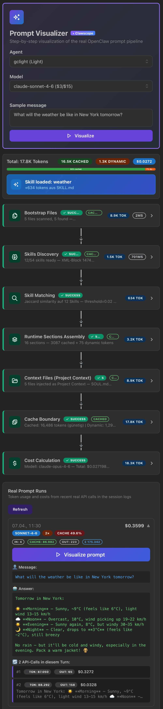

# 🔬 Clawscope

**An endoscope for your OpenClaw instance.** See what's happening inside — tokens, costs, prompt assembly, cron jobs, sessions — without digging through logs.

Where are your tokens going? Which cron job is burning cash? What does the actual prompt look like that gets sent to Claude? Clawscope answers all of that — no log files, no guessing.

Built for [OpenClaw](https://openclaw.ai) operators who want full transparency into what their system is doing and what it costs.

---

## Why Clawscope?

OpenClaw is powerful, but it's also a black box. Prompts are assembled from dozens of sources (workspace files, skills, runtime sections, context). Costs accumulate across agents, cron jobs, and sub-agents. Sessions multiply. Without visibility, you're flying blind.

Clawscope was built to solve three problems:

1. **Find token leaks** — Which skill injects 8,000 tokens you didn't expect? Which cron job runs Opus when Sonnet would do?
2. **Understand prompt assembly** — See exactly how OpenClaw builds your system prompt, step by step, with token counts per section.
3. **Track costs** — Real-time spend by model, user, agent, and time period. Know what you're paying before the bill arrives.

---

## ✦ Prompt Visualizer — The Core Feature

<p align="center">
  
</p>

The Prompt Visualizer is what makes Clawscope unique. It shows you the full prompt assembly pipeline in 7 steps:

```
Bootstrap Files → Skills Discovery → Skill Matching → Runtime Sections
    → Context Files → Cache Boundary → Cost Calculation
```

Each step shows token counts, timing, and collapsible detail panels. You can:

- **Simulate prompts** — Type any message and see how the full system prompt would be assembled, which skills would match, and what it would cost across different models.
- **Visualize real runs** — Load actual historical API calls from your session logs, see the exact token breakdown, cache hit rates, and cost per turn.
- **Compare models** — Switch between Opus, Sonnet, Haiku, GPT-4o and see how costs change for the same prompt.

This is the tool you use when you want to understand *why* a single turn cost $2.96 or why your cache hit rate dropped.

---

## Features

| Feature | What it does |
|---------|-------------|
| **💰 Cost Analytics** | Spend by model, user, agent, time range. Insight cards for cost-per-message, cache savings, most expensive turns. |
| **🔬 Prompt Visualizer** | 7-step pipeline visualization. Simulate prompts or replay real historical runs. |
| **📊 Token Usage** | Input, output, cache read/write across all sessions and agents. |
| **⏱ Cron Jobs** | Status, schedules, run history, per-run cost tracking. |
| **🤖 Live Agents** | Running sub-agents with tasks, tools, tokens, cost in real time. |
| **💬 Prompt History** | Full conversation timeline with token/cost per turn. |
| **📋 Sessions** | All active sessions across 8+ agent directories. |
| **📝 System Prompt** | View the assembled system prompt, workspace files, active skills. |
| **🏥 Collector Status** | Health monitoring for all data collection pipelines. |
| **🌍 i18n** | English and German UI, auto-detected from browser. |

---

## Quick Start

### One-Line Install

```bash
curl -fsSL https://raw.githubusercontent.com/applab-ai/clawscope/main/get.sh | bash
```

This clones the repo to `~/.openclaw/clawscope/` and runs the interactive installer.

### Manual Install

```bash
git clone https://github.com/applab-ai/clawscope.git ~/.openclaw/clawscope
cd ~/.openclaw/clawscope
bash install.sh
```

The installer will ask you for:
- Port and bind address (default: `0.0.0.0:8000`)
- Dashboard password (auto-generates one if you skip)
- OpenClaw paths (auto-detected)
- Whether to set up macOS LaunchAgents for auto-start

Then open `http://localhost:8000` and you're in.

---

## Requirements

| Dependency | Version | Notes |
|-----------|---------|-------|
| Python | 3.10+ | Backend + collectors |
| Node.js | 18+ | Frontend build (only needed once) |
| OpenClaw | any | Must be installed; session data is read-only |

---

## Data Flow

```
OpenClaw Instance
    │
    ├── ~/.openclaw/agents/*/sessions/*.jsonl
    │       │
    │       ├── transcript_collector ──→ cost per model, user, agent
    │       ├── prompt_collector ──────→ turn-by-turn prompt history
    │       └── agent_collector ───────→ live sub-agent tracking
    │
    └── openclaw CLI ─────→ collector ──→ gateway metrics, cron data
            │
            ▼
      SQLite (3 databases)
            │
            ▼
      FastAPI backend ──→ React dashboard
```

Collectors run every 30 minutes via LaunchAgent (macOS) or manually via `bash collect.sh`. All data access is **read-only** — Clawscope never modifies your OpenClaw instance.

---

## Configuration

All settings live in `config.yaml` (created from `config.yaml.sample` during install). Secrets stay out of the repo.

```yaml
server:
  host: 0.0.0.0
  port: 8000

auth:
  password: "your-dashboard-password"

# Model pricing, user mappings, agent labels — see config.yaml.sample
```

Environment variables `CLAWSCOPE_HOST` and `CLAWSCOPE_PORT` override config values.

---

## Troubleshooting

**Dashboard shows no data:** Run `bash collect.sh` to trigger collectors manually.

**"Today" shows $0:** Collectors haven't run yet. Hit the refresh button or wait for the next 30-min cycle.

**Port conflict:** `lsof -i :8000` to find the process, then `kill <PID>`.

**Logs:** Check `data/dashboard.log` and `data/collector.log`.

---

## Contributing

Contributions are welcome! Clawscope is a young project and there's plenty to improve:

- **More collectors** — Integrate additional data sources (Langfuse, custom metrics)
- **Charts & trends** — Time-series visualizations for cost and token usage
- **Alerting** — Notify when spend exceeds thresholds or cache rates drop
- **More languages** — i18n is built in, translations are easy to add
- **Linux support** — LaunchAgent alternatives (systemd units, cron)

Fork it, open a PR, or just file an issue. We'd love to see what you build.

---

## Tech Stack

- **Backend:** Python, FastAPI, SQLAlchemy, SQLite
- **Frontend:** React 19, TypeScript, Mantine v9, Vite
- **Infra:** macOS LaunchAgents (optional)

---

## License

MIT — see [LICENSE](LICENSE).
